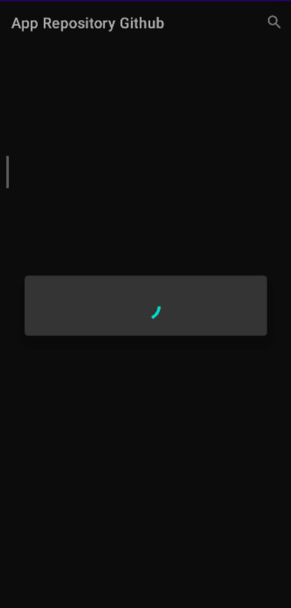
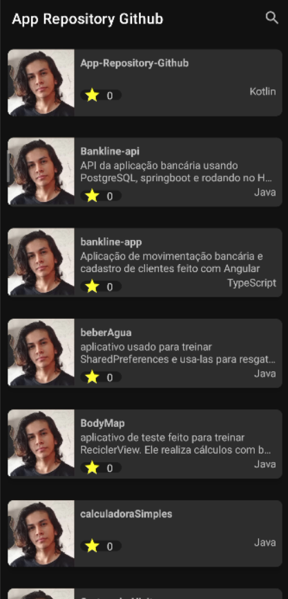
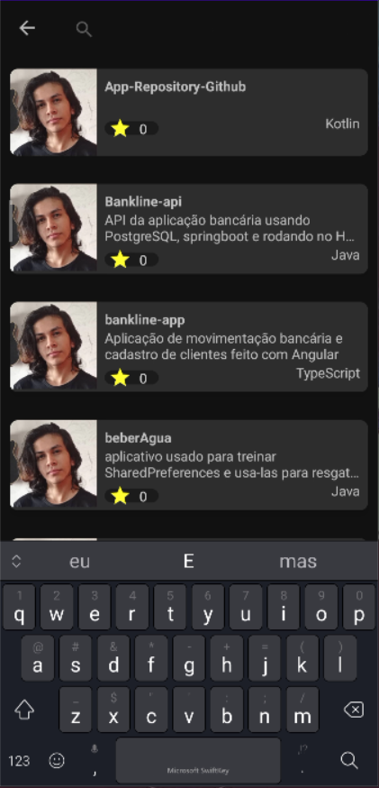
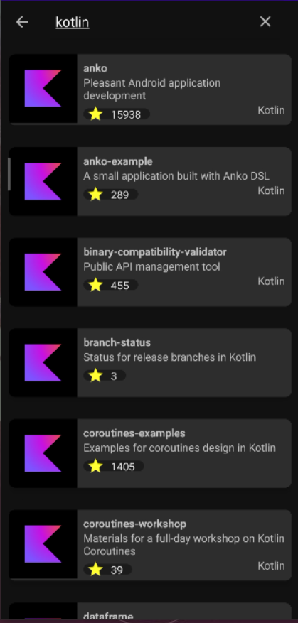

# App Repository Github

<h1>Aplicativo que mostra seus repositórios</h1>
  
 
 

 
Ao iniciar o aplicativo ele mostra o carregamento

logo após ele carrega os repositórios do usuário

O aplicativo também permite pesquisas

E exibição de repositórios de outros usuários

 
